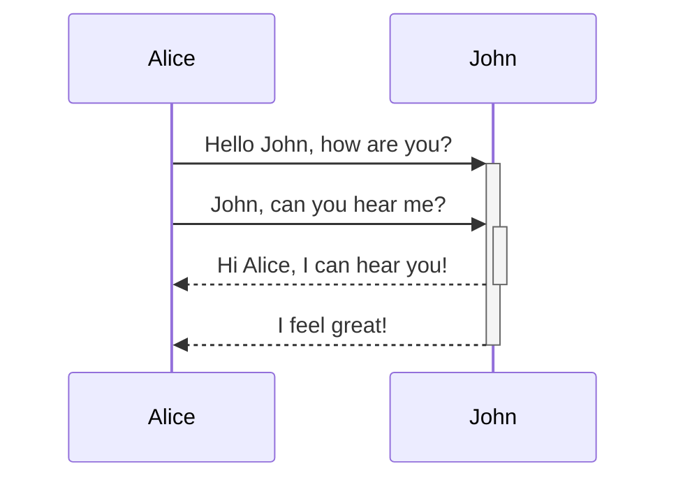

---
tags:
  - recipe
  - cooking
---

# no-links-input.md

## Lists

You can create an unordered list by adding a -, \*, or + before the text.

- First list item
- Second list item
- Third list item
  First list item
  Second list item
  Third list item
  To create an ordered list, start each line with a number followed by a . symbol.

1. First list item
2. Second list item
3. Third list item
   First list item
   Second list item
   Third list item
   Task lists
   To create a task list, start each list item with a hyphen and space followed by [ ].

## tasks

- [x] This is a completed task.
- [ ] This is an incomplete task.

## External links

If you want to link to an external URL, you can create an inline link by surrounding the link text in brackets ([ ]), and then the URL in parentheses (( )).

[Obsidian Help](https://help.obsidian.md)

You can change the image dimensions, by adding |640x480 to the link destination, where 640 is the width and 480 is the height.


## code block

```python
print("Hello, Obsidian!")
```

## Tables

You can create tables using vertical bars (|) to separate columns and hyphens (-) to define headers. Here's an example:

| First name | Last name |
| ---------- | --------- |
| Max        | Planck    |
| Marie      | Curie     |

## Diagram

You can add diagrams and charts to your notes, using Mermaid. Mermaid supports a range of diagrams, such as flow charts, sequence diagrams, and timelines.

> [!Tip]
> You can also try Mermaid's Live Editor to help you build diagrams before you include them in > your notes.

To add a Mermaid diagram, create a mermaid code block.


